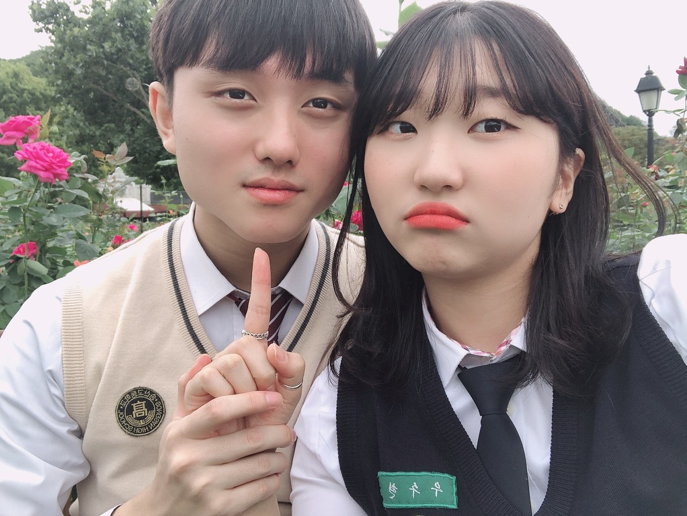
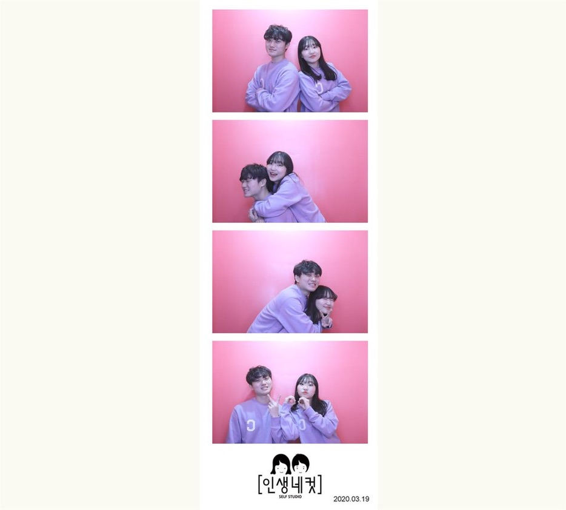
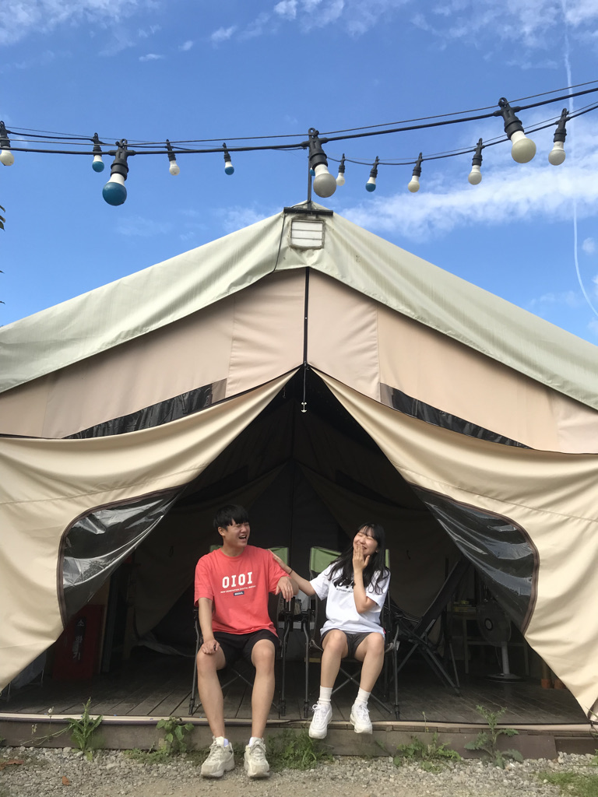
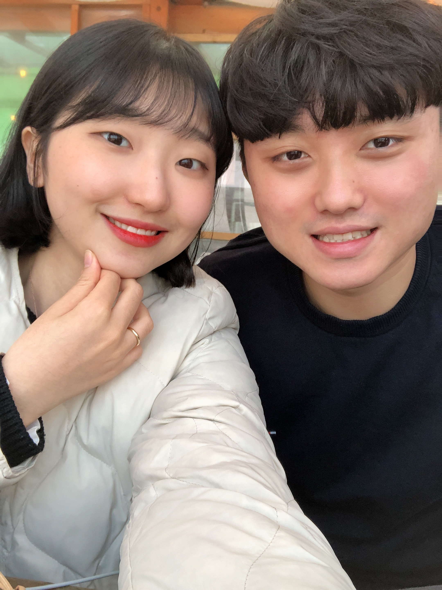

##  📑 연습1
안녕하세요! 오늘은 사진 업로드 연습을 해볼 거예요. 바로 첫 번째 과제입니다~ 
연습을 하는 김에 저희 (수현 + 연권)의 추억 여행 한 번 해보려고 하는데요~ 
놓치지 말고 잘 따라오세요 :)  
 
 

## 1. 2019년 
---

먼저 2019년 사진입니다! 

이곳은 바로 '환상의 나라' 에버랜드인데요. 코로롱이 없을 때라 마스크도 안 끼고 아주 좋았답니다!!
이곳엔 저희의 은밀한 추억이 담긴 장소들도 있답니다 ^^. 
어디일지 궁금하시죠~?? (비밀~🤫)

그리고 이때 할로윈 시즌이라 호러 사파리도 갔었는데요! 처음 경험해 본 호러 사파리였는데, 좀비분들도 아주 열심히 따라다니시고 굉장히 재밌었습니다!! 지금 생각하면 그분들도 일하느라 고생이 많으셨네요 ㅠㅠ 

모든 직장인분들 화이팅입니다!!!

 
 

## 2. 2020년 
---

이제 2020년 사진을 둘러보도록 해요!!

저희의 커플티 아주 귀엽지 않나요?? 보라보라 한 게 참 풋풋하네용 
이땐 아마 인계동에서 사주를 봤던 날인 것 같은데요! 사주 또한 처음 봐본 것이라 굉장히 설레고 재미난 경험이었습니다. 
처음엔 안 좋은 말들만 가득할까 봐 걱정이 한가득이었는데, 뭐 딱히 그렇진 않더라고요~ ^^ 

이 자리를 빌려 저에게 신선한 경험을 선사해 주신 '달콘박스'님에게 감사의 말씀을 전합니다! 

  (((((다음에 또 보러가좌!!!)))))<grey>
  

 
 

## 3. 2021년 
---
다음은 2021년 사진입니다! 

요긴 바로 기흥 글램핑장인데요! 제가 글램핑을 너무 가고 싶어 했는데, '달콘박스'님이 선뜻 함께해 주셔서 소중한 시간을 보낼 수 있었습니다. 
그리고 요 날엔 '달콘박스님'께서 절 위해 양갈비도 미리 준비를 해주셔서 야무지게 뜯어먹었습니다!! 
양갈비도 처음 먹어보는 거였는데, 숯불에 구우니 숯 향이 솔솔 올라와서 너어어무 맛있었습니다. 
이런 걸 바로 제이엠티라고 하나요?? ˚✧₊⁎( ˘ω˘ )⁎⁺˳✧༚ JMT!!!!! 
이렇게 적고 보니 달콘박스님께서 절 많이 애껴주시고 있다는 게 참 많이 느껴지네요. 

앞으로도 잘 부탁드려요＼＼\٩(๑•̀ㅂ•́)و//／／

 
 

## 4. 2022년 
---
마지막으로 2022년 사진입니다!

벌써 저희가 함께한 지도 햇수로는 4년이네요. 시간 참 빠르죠?? 
시간이 흐른 만큼 저희의 얼굴도 무언가 옆으로 넓어지는 것 같기도 하는데요..ㅎㅎ 
뭐 그만큼 즐겁고 행복하다는 거 아니겠습니다^^~? 
아래 사진만 보아도 편안해 보이네요! 아 그리고 궁금해 하실까봐 알려드리는데, 요 장소는 바로 바로 강릉입니다!
'카페 오두막'이라는 카페인데요. 장소는 협소하지만, 아지자기하게 오션뷰를 즐길 수 있는 장소여서 저는 참 좋았답니다.

어디 카페인지 궁금하신 분들은 아래 링크 참고 부탁드립니다! 
저는 한적한 바다를 느끼고 싶다면 추천 드리고 싶네요^^. 
링크는 여기에 (｢･ω･)｢   [카페 오두막](https://map.naver.com/v5/search/%EA%B0%95%EB%A6%89%20%EC%B9%B4%ED%8E%98%EC%98%A4%EB%91%90%EB%A7%89/place/1304055178?c=14348193.0318410,4553267.3822400,16,0,0,0,dh)

그럼 오늘 글은 여기서 마무리할게요! 
다음에 또 놀러 오세요!! 서이추 + 댓글 환영합니다^^

